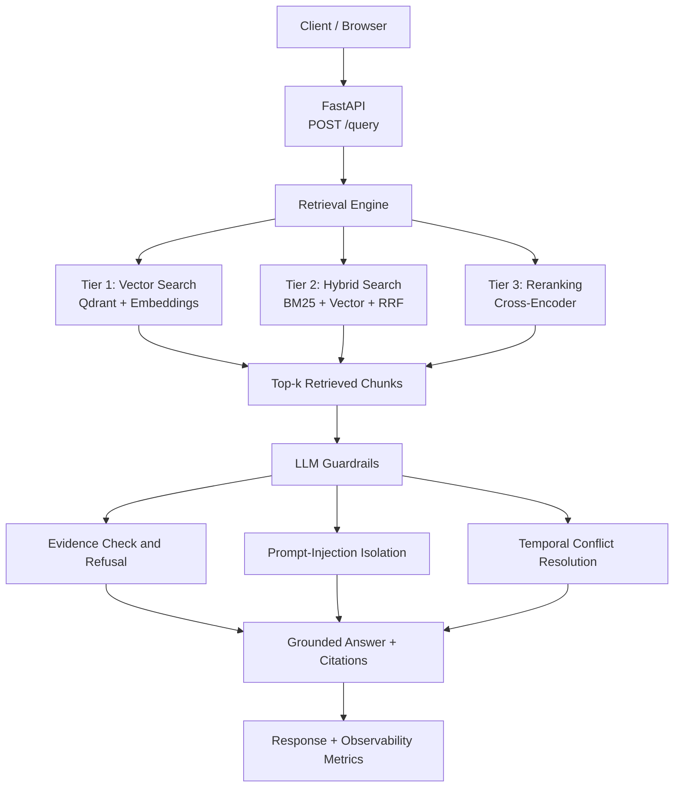

Envint — Advanced Hybrid Retrieval & Reranking Benchmark (Option B)
A compliance-focused question-answering engine over policy and operations manuals. It benchmarks three retrieval strategies with evidence-based guardrails, prompt-injection isolation, temporal conflict handling, observability, and Docker support.
> **Cost model:** The local configuration makes no paid API calls. Hugging Face models run locally after download; the optional LLM can run through Ollama. Tests and CI use deterministic offline backends.
1. Architecture

Observability middleware records latency, token counts when available, and errors. The benchmark runner evaluates all three retrieval tiers and writes structured results to `results/benchmark_eval.json`.
Request flow: `POST /query` → retrieve using the selected tier → apply evidence and safety checks → generate a grounded answer with citations → record latency, token usage, and errors.
2. The three retrieval tiers
Tier	Strategy	What it does	Strength
1	`vector`	Embeds the query and searches Qdrant using cosine similarity	Semantic meaning and paraphrases
2	`hybrid`	Combines BM25 and vector rankings with Reciprocal Rank Fusion (RRF)	Exact keywords, clause IDs, and numbers
3	`rerank`	Re-scores Tier 2 candidates with a cross-encoder	Better ordering for hard negatives
Custom RRF (`app/retrieval/rrf.py`) combines rankings rather than comparing incompatible raw BM25 and vector scores. A chunk ranked at position `r` receives `1 / (k + r)` from each list. The configured `k=60` reduces the dominance of any single rank.
3. Technology choices and trade-offs
Concern	Choice	Why / trade-off
Vector database	Qdrant	Open-source; in-memory mode supports tests, while Docker Compose runs a Qdrant service
Embeddings	`BAAI/bge-small-en-v1.5` (384 dimensions)	Compact, CPU-friendly model
Keyword retrieval	`rank_bm25`	Lightweight lexical retrieval
Fusion	Custom RRF	Transparent rank fusion without comparing raw score scales
Reranker	`BAAI/bge-reranker-base` by default	Lower CPU cost than the larger model; configurable with `RERANK_MODEL`
LLM	Ollama when configured; extractive fallback	Local generation is optional; extractive mode is deterministic
API	FastAPI + Uvicorn	Typed API and interactive documentation
Metrics	Custom evaluation code	Explicit metric definitions
Observability	Custom middleware	Latency, token usage, and error logging
CI	GitHub Actions	Runs the offline test suite
Offline test backends. `EMBED_BACKEND=fake`, `RERANK_BACKEND=fake`, and `LLM_BACKEND=extractive` select deterministic lightweight implementations. Tests can run without downloading ML models.
4. Setup and reproduction
Option A — Docker
Run commands from the repository root.
```bash
# Start Qdrant and the API
docker compose up --build api
```
The API is available at `http://localhost:8000`. The first build/start with real models may download model files.
In a second terminal:
```bash
# Full test suite using offline backends
docker compose --profile test run --rm tests

# Retrieval benchmark
docker compose --profile benchmark run --rm benchmark
```
Option B — Local Python (Windows PowerShell)
```powershell
python -m venv .venv
.\.venv\Scripts\Activate.ps1
python -m pip install -r requirements.txt
```
Run the API:
```powershell
uvicorn app.main:app --reload
```
Run tests using deterministic backends:
```powershell
$env:EMBED_BACKEND = "fake"
$env:RERANK_BACKEND = "fake"
$env:LLM_BACKEND = "extractive"
python -m pytest -q
```
Run the benchmark and robustness checks:
```powershell
python -m app.eval.benchmark --split eval
python -m app.eval.llm_robustness
```
Try the API
Web UI: `http://localhost:8000/`
Swagger UI: `http://localhost:8000/docs`
Example request:
```bash
curl -s http://localhost:8000/query \
  -H "content-type: application/json" \
  -d '{"query":"how often must passwords be rotated?","strategy":"rerank"}'
```
Optional local LLM
Install Ollama and pull a model:
```bash
ollama pull llama3.2:3b
```
Set `LLM_BACKEND=auto` in the environment before starting the API. Confirm the supported backend values and fallback behaviour in `app/config.py`.
5. Benchmark results and interpretation
The evaluation split contains 14 queries: 12 queries with relevance labels and 2 unsupported queries. The following measurements were recorded using the real local embedding and reranking setup. They are environment-specific; CI tests use deterministic offline backends. Raw output: `results/benchmark_eval.json`.
Strategy	Precision@5	Recall@5	MRR	NDCG@5	p50 (ms)	p95 (ms)	Peak RSS (MB)
Vector	0.2167	1.000	0.9167	0.9318	19.23	29.75	556.3
Hybrid	0.2167	1.000	0.9167	0.9385	16.42	22.46	538.3
Rerank	0.2167	1.000	0.9583	0.9692	872.96	952.24	1151.1
Interpretation and trade-offs
Ranking quality: Reranking has the highest MRR (0.9583) and NDCG@5 (0.9692). Hybrid retrieval improves NDCG@5 over vector-only retrieval (0.9385 vs. 0.9318).
Latency: Vector and hybrid p50 latency are 19.23 ms and 16.42 ms. Reranking increases p50 latency to 872.96 ms and p95 latency to 952.24 ms because the cross-encoder scores candidates individually.
Precision and recall: Precision@5 is 0.2167 and Recall@5 is 1.0 for all three strategies in this run. MRR and NDCG@5 distinguish ranking quality. Results are preliminary because the corpus and evaluation set are small and synthetic.
Metric caveat: Precision@5 depends on the relevance labels and metric implementation. Check `app/eval/metrics.py` before comparing these values with another benchmark.
Index and refresh cost trade-offs. The recorded index-build time was approximately 13.87 seconds for the current corpus and environment. Build time depends on the embedding model, hardware, and corpus size. Re-embedding is required when the embedding model changes. Chunks store an `embedding_version` so the active model version can be tracked. The reranker scores candidates at query time and does not require a separate vector index.
6. Cost per query and token
The local configuration makes no paid API calls, so direct API cost is $0. The compute estimate in `app/eval/cost.py` assumes a CPU VM price of `$0.10/hour`:
```text
compute_cost_usd    = latency_hours × COMPUTE_USD_PER_HOUR
api_cost_usd        = 0.0 for local models
paid_equivalent_usd = estimated hosted-API cost for comparison only
```
Illustrative extractive-backend example: for a request taking approximately 1 ms:
`compute_cost_usd` ≈ `(0.001 / 3600) × $0.10` ≈ $2.8e-8
`api_cost_usd` = $0 when using local models
`paid_equivalent_usd` is a hypothetical hosted-API comparison, not an actual expense.
These are illustrative estimates, not the measured cost of a real-model reranking request. Actual compute cost depends on strategy, hardware, and latency. Token counts are returned in `/query` responses when available and logged by the observability middleware.
7. Robustness features
Hard-negative dataset: `data/queries/` contains 19 queries split into dev (5) and eval (14). Examples include opposite-meaning keyword matches, clause IDs, numeric thresholds, unsupported questions, and a temporal conflict.
Refusal on missing evidence: the `is_supported()` check refuses when retrieved evidence does not sufficiently support the query. The current implementation uses a lexical heuristic and may miss semantically related wording.
Prompt-injection isolation: retrieved text is treated as untrusted data rather than instructions. The extractive backend copies sentences rather than executing instructions from retrieved content. See tests for the exact behaviours validated.
Temporal conflict resolution: when clauses assert different retention periods, the engine surfaces the conflict and prioritizes the more recent clause according to the implementation.
Observability: middleware records request latency, token usage when available, and errors; metrics are exposed through `/metrics`.
8. Testing
The Docker test profile completed successfully with 59 tests passing in the recorded run. The reported split is 36 unit tests and 23 integration tests; verify the current collection if tests have changed.
Coverage includes RRF, retrieval metrics, BM25, guardrails, embeddings, cost calculations, schema validation, the three-tier engine, API success and failure paths, malformed inputs, empty results, rate-limit failures, embedding-version handling, and dependency failures.
Run locally with:
```powershell
$env:EMBED_BACKEND = "fake"
$env:RERANK_BACKEND = "fake"
$env:LLM_BACKEND = "extractive"
python -m pytest -q
```
Deprecation warnings were observed for FastAPI startup event handlers and Qdrant's `recreate_collection` method. They did not cause the recorded test run to fail.
9. Known limitations
Small synthetic corpus: the corpus is small and pre-chunked. Results may not generalize to larger or production document collections.
Limited evaluation set: the benchmark uses 14 evaluation queries, of which 12 have relevance labels. Larger independently authored evaluation sets are needed for stronger conclusions.
Local hardware measurements: latency and memory results depend on machine, model versions, and warm-up state; they are not universal performance guarantees.
Reranker cost: the cross-encoder substantially increases latency and memory use in the measured setup. Use it when ranking improvements justify that overhead.
Lexical support heuristic: the refusal/support check is heuristic. Production use would benefit from semantic support scoring, calibrated thresholds, and human evaluation.
Dependency deprecations: the code emits deprecation warnings for FastAPI startup events and Qdrant collection recreation; these should be migrated in a future maintenance pass.
Local model requirements: real embedding and reranking models require model downloads and sufficient memory. CI uses fake backends and does not validate real-model performance.
10. Repository layout
```text
app/
  config.py            Environment-overridable settings
  schema.py            Payload and chunk-metadata schemas
  embeddings.py        Real and fake embedders
  ingest.py            Corpus loading and validation
  retrieval/           Vector, BM25, RRF, reranking, retrieval engine
  eval/                Metrics, benchmark, cost, LLM robustness
  llm/                 Guardrails and LLM clients
  obs/                 Observability middleware
  main.py              FastAPI application
  static/index.html    Browser UI
data/
  corpus/corpus.json   Policy and operations chunks
  queries/             Development and evaluation query sets
tests/
  unit/                Unit tests
  integration/         Integration tests
docker/
  Dockerfile
docker-compose.yml
.github/workflows/ci.yml
```
Reproducibility notes
Run commands from the repository root.
Do not commit `.env`, virtual environments, model caches, or the assignment PDF.
For offline tests, explicitly set the fake embedding and reranker backends.
Keep benchmark result files alongside the README and explain whether results came from real local models or deterministic offline backends.
