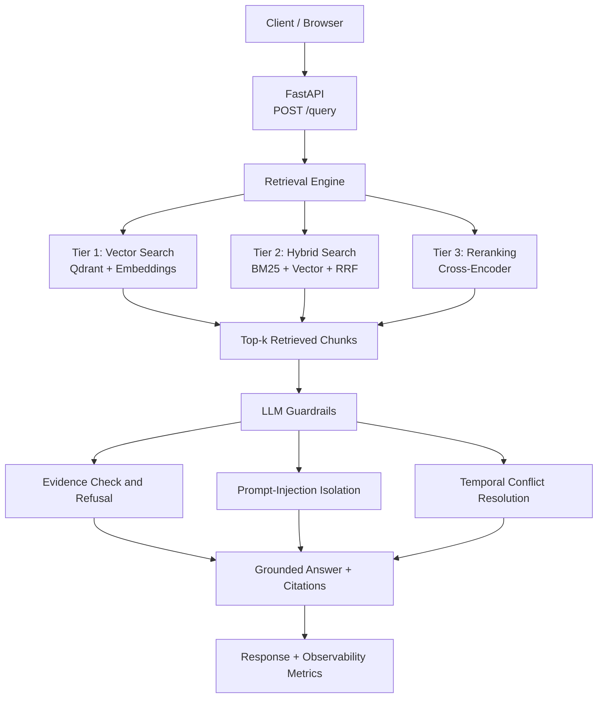

Envint — Advanced Hybrid Retrieval & Reranking Benchmark (Option B)
A compliance-focused question-answering engine over policy and operations manuals. It compares three retrieval strategies and includes evidence-based guardrails, prompt-injection isolation, temporal conflict handling, observability, and Docker support.
Quick links (when the API is running locally):  
🚀 Open the Web UI · 📚 Open API Docs · ❤️ Health Check · 📈 Metrics
> These links work on the computer running the application after you start it. They will not open a hosted website for other people.
1. Quick start — Docker (recommended)
Run these commands from the repository root.
```powershell
# Start Qdrant and the API
docker compose up --build api
```
When startup finishes, click one of these links:
Open Envint Web UI
Open interactive API documentation
Check API health
Keep that terminal open while using the application. To stop it, press `Ctrl+C`. If the containers are still running in the background, use:
```powershell
docker compose down
```
Run tests and benchmark
Open a second terminal in the repository root:
```powershell
# Full test suite using deterministic/offline backends
docker compose --profile test run --rm tests

# Run the retrieval benchmark
docker compose --profile benchmark run --rm benchmark
```
The first Docker build with real models may download model files and take several minutes. If the image is already built and you have not changed dependencies or the Dockerfile, you do not need to rebuild just to read the README or use the running app.
2. Architecture

Request flow: the client submits a question to `POST /query`; the selected retrieval tier finds relevant chunks; guardrails check evidence and untrusted content; the API returns an answer with citations and records available latency, token, and error metrics.
The benchmark runner evaluates all three retrieval tiers and writes structured results to `results/benchmark_eval.json`.
3. The three retrieval tiers
Tier	Strategy	What it does	Strength
1	`vector`	Embeds the query and searches Qdrant using cosine similarity	Semantic meaning and paraphrases
2	`hybrid`	Combines BM25 and vector rankings with Reciprocal Rank Fusion (RRF)	Exact keywords, clause IDs, and numbers
3	`rerank`	Re-scores Tier 2 candidates with a cross-encoder	Better ordering for hard negatives
Custom RRF in `app/retrieval/rrf.py` combines rankings instead of comparing incompatible raw BM25 and vector scores. A chunk ranked at position `r` receives a contribution based on `1 / (k + r)` from each list; the configured `k=60` reduces the dominance of any single rank.
4. Technology choices and trade-offs
Concern	Choice	Trade-off
Vector database	Qdrant	Open-source; in-memory mode supports tests, Docker Compose runs a Qdrant service
Embeddings	`BAAI/bge-small-en-v1.5` (384 dimensions)	Compact and CPU-friendly, but still requires model files for real inference
Keyword retrieval	`rank_bm25`	Lightweight lexical retrieval
Fusion	Custom RRF	Transparent rank fusion without comparing raw score scales
Reranker	`BAAI/bge-reranker-base` by default	Improves ranking but increases latency and memory use
LLM	Ollama when configured; extractive fallback	Local generation is optional; extractive mode is deterministic
API	FastAPI + Uvicorn	Typed API and interactive documentation
Metrics	Custom evaluation code	Explicit metric definitions
Observability	Custom middleware	Latency, token usage when available, and error logging
CI	GitHub Actions	Runs the offline test suite
Offline test backends: `EMBED_BACKEND=fake`, `RERANK_BACKEND=fake`, and `LLM_BACKEND=extractive` select deterministic lightweight implementations. Tests can run without downloading ML models.
5. Run locally with Python (Windows PowerShell)
If you are not using Docker, create and activate a virtual environment, then install dependencies:
```powershell
python -m venv .venv
.\.venv\Scripts\Activate.ps1
python -m pip install -r requirements.txt
```
Start the API:
```powershell
uvicorn app.main:app --reload
```
Then click:
Open Envint Web UI
Open interactive API documentation
Check API health
View metrics
To run tests using deterministic backends, open another terminal:
```powershell
$env:EMBED_BACKEND = "fake"
$env:RERANK_BACKEND = "fake"
$env:LLM_BACKEND = "extractive"
python -m pytest -q
```
Run the benchmark and robustness checks:
```powershell
python -m app.eval.benchmark --split eval
python -m app.eval.llm_robustness
```
6. Try the API
You can use the browser-based UI or send a request directly:
```bash
curl -s http://localhost:8000/query \
  -H "content-type: application/json" \
  -d '{"query":"how often must passwords be rotated?","strategy":"rerank"}'
```
In PowerShell, `curl` may be an alias. You can use `Invoke-RestMethod` instead:
```powershell
$body = @{
  query = "how often must passwords be rotated?"
  strategy = "rerank"
} | ConvertTo-Json

Invoke-RestMethod -Uri "http://localhost:8000/query" `
  -Method Post -ContentType "application/json" -Body $body
```
Optional local LLM
Install Ollama and pull a model if you want to try a local generative backend:
```powershell
ollama pull llama3.2:3b
```
Set `LLM_BACKEND=auto` in the environment before starting the API. Confirm supported backend values and fallback behaviour in `app/config.py`. The default extractive backend does not require a paid API.
7. Benchmark results and interpretation
The evaluation split contains 14 queries: 12 with relevance labels and 2 unsupported queries. The following measurements were recorded using the real local embedding and reranking setup. They are environment-specific; CI tests use deterministic offline backends. Raw output: `results/benchmark_eval.json`.
Strategy	Precision@5	Recall@5	MRR	NDCG@5	p50 (ms)	p95 (ms)	Peak RSS (MB)
Vector	0.2167	1.000	0.9167	0.9318	19.23	29.75	556.3
Hybrid	0.2167	1.000	0.9167	0.9385	16.42	22.46	538.3
Rerank	0.2167	1.000	0.9583	0.9692	872.96	952.24	1151.1
What the results mean
Ranking quality: Reranking has the highest recorded MRR (0.9583) and NDCG@5 (0.9692). Hybrid retrieval improves NDCG@5 over vector-only retrieval (0.9385 vs. 0.9318).
Latency: Vector and hybrid p50 latency are 19.23 ms and 16.42 ms. Reranking increases p50 to 872.96 ms and p95 to 952.24 ms in this run.
Precision and recall: Precision@5 is 0.2167 and Recall@5 is 1.0 for all three strategies in this run. The corpus and evaluation set are small and synthetic, so these results are preliminary.
Metric caveat: Precision@5 depends on the relevance labels and metric implementation. Check `app/eval/metrics.py` before comparing these values with another benchmark.
The recorded index-build time was approximately 13.87 seconds for this corpus and environment. Build time depends on the embedding model, hardware, and corpus size. Re-embedding is required when the embedding model changes. Chunks store an `embedding_version`; the reranker scores candidates at query time and does not need a separate vector index.
8. Cost per query and token
The local configuration makes no paid API calls, so direct API cost is `$0`. The compute estimate in `app/eval/cost.py` assumes a CPU VM price of `$0.10/hour`:
```text
compute_cost_usd    = latency_hours × COMPUTE_USD_PER_HOUR
api_cost_usd        = 0.0 for local models
paid_equivalent_usd = estimated hosted-API cost for comparison only
```
For an illustrative extractive-backend request taking approximately 1 ms:
`compute_cost_usd` ≈ `(0.001 / 3600) × $0.10` ≈ `$2.8e-8`
`api_cost_usd` = `$0` when using local models
`paid_equivalent_usd` is a hypothetical hosted-API comparison, not an actual expense.
These are illustrative estimates, not the measured cost of a real-model reranking request. Actual compute cost depends on strategy, hardware, and latency. Token counts are returned in `/query` responses when available and logged by the observability middleware.
9. Robustness and observability
Refusal on missing evidence: the `is_supported()` check refuses when retrieved evidence does not sufficiently support the query. It uses a lexical heuristic and may miss semantically related wording.
Prompt-injection isolation: retrieved text is treated as untrusted data rather than instructions. The extractive backend copies sentences rather than executing instructions from retrieved content.
Temporal conflict handling: when clauses assert different retention periods, the engine surfaces the conflict and prioritizes the more recent clause according to the implementation.
Observability: middleware records request latency, token usage when available, and errors. Metrics are exposed at `/metrics` when the service is running.
The hard-negative dataset contains 19 queries split into development (5) and evaluation (14). Examples include opposite-meaning keyword matches, clause IDs, numeric thresholds, unsupported questions, and a temporal conflict.
10. Testing
The Docker test profile completed successfully with 59 tests passing in the recorded run. The reported split is 36 unit tests and 23 integration tests; verify the current collection if tests have changed.
Coverage includes RRF, retrieval metrics, BM25, guardrails, embeddings, cost calculations, schema validation, the three-tier engine, API success and failure paths, malformed inputs, empty results, rate-limit failures, embedding-version handling, and dependency failures.
Run locally:
```powershell
$env:EMBED_BACKEND = "fake"
$env:RERANK_BACKEND = "fake"
$env:LLM_BACKEND = "extractive"
python -m pytest -q
```
Deprecation warnings were observed for FastAPI startup event handlers and Qdrant's `recreate_collection` method. They did not cause the recorded test run to fail.
11. Known limitations
Small synthetic corpus: the corpus is small and pre-chunked; results may not generalize to larger or production document collections.
Limited evaluation set: the benchmark uses 14 evaluation queries, of which 12 have relevance labels. Larger independently authored evaluation sets are needed for stronger conclusions.
Local hardware measurements: latency and memory results depend on machine, model versions, and warm-up state; they are not universal performance guarantees.
Reranker overhead: the cross-encoder substantially increases latency and memory use in the measured setup. Use it when ranking improvements justify that overhead.
Lexical support heuristic: production use would benefit from semantic support scoring, calibrated thresholds, and human evaluation.
Dependency deprecations: FastAPI startup events and Qdrant collection recreation should be migrated in a future maintenance pass.
Local model requirements: real embedding and reranking models require model downloads and sufficient memory. CI uses fake backends and does not validate real-model performance.
12. Repository layout
```text
app/
  config.py
  schema.py
  embeddings.py
  ingest.py
  retrieval/           Vector, BM25, RRF, reranking, retrieval engine
  eval/                Metrics, benchmark, cost, LLM robustness
  llm/                 Guardrails and LLM clients
  obs/                 Observability middleware
  main.py              FastAPI application
  static/index.html    Browser UI
data/
  corpus/corpus.json   Policy and operations chunks
  queries/             Development and evaluation query sets
tests/
  unit/                Unit tests
  integration/          Integration tests
docker/
  Dockerfile
docker-compose.yml
.github/workflows/ci.yml
```
Reproducibility and submission notes
Run commands from the repository root.
Do not commit `.env`, virtual environments, model caches, or the assignment PDF.
For offline tests, explicitly set the fake embedding and reranker backends.
Keep benchmark result files alongside the README and state whether results came from real local models or deterministic offline backends.
